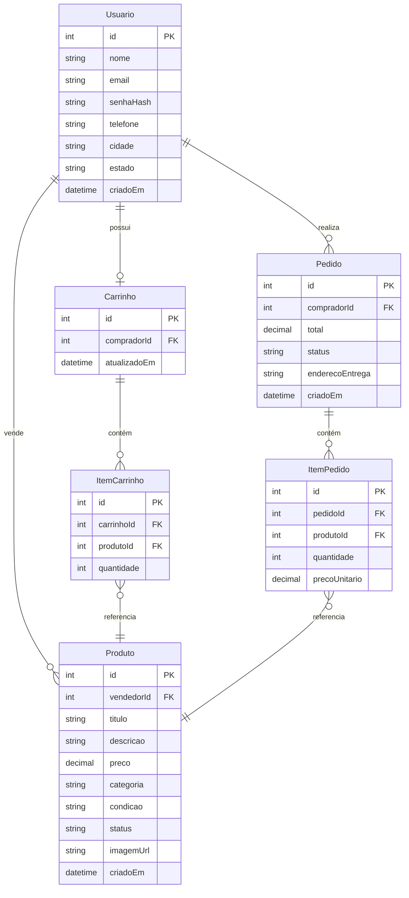
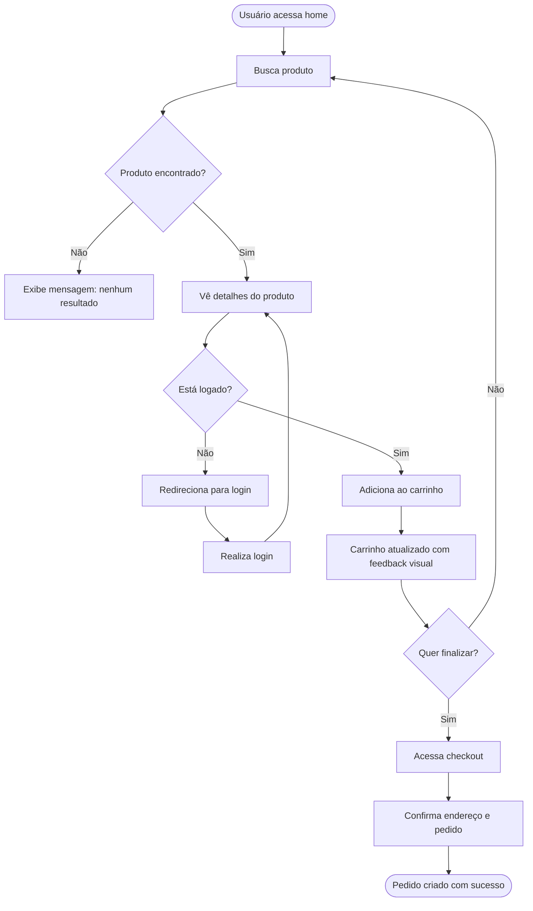

# Diagramas TechBazar

## Diagrama ER

```mermaid
erDiagram
    Usuario {
        int id PK
        string nome
        string email
        string senhaHash
        string telefone
        string cidade
        string estado
        datetime criadoEm
    }
    Produto {
        int id PK
        int vendedorId FK
        string titulo
        string descricao
        decimal preco
        string categoria
        string condicao
        string status
        string imagemUrl
        datetime criadoEm
    }
    Carrinho {
        int id PK
        int compradorId FK
        datetime atualizadoEm
    }
    ItemCarrinho {
        int id PK
        int carrinhoId FK
        int produtoId FK
        int quantidade
    }
    Pedido {
        int id PK
        int compradorId FK
        decimal total
        string status
        string enderecoEntrega
        datetime criadoEm
    }
    ItemPedido {
        int id PK
        int pedidoId FK
        int produtoId FK
        int quantidade
        decimal precoUnitario
    }

    Usuario ||--o{ Produto : "vende"
    Usuario ||--o| Carrinho : "possui"
    Usuario ||--o{ Pedido : "realiza"
    Carrinho ||--o{ ItemCarrinho : "contém"
    ItemCarrinho }o--|| Produto : "referencia"
    Pedido ||--o{ ItemPedido : "contém"
    ItemPedido }o--|| Produto : "referencia"
```

## Diagrama de Fluxo — Busca e Adição ao Carrinho

```mermaid
flowchart TD
    A([Usuário acessa home]) --> B[Busca produto]
    B --> C{Produto encontrado?}
    C -- Não --> D[Exibe mensagem: nenhum resultado]
    C -- Sim --> E[Vê detalhes do produto]
    E --> F{Está logado?}
    F -- Não --> G[Redireciona para login]
    G --> H[Realiza login]
    H --> E
    F -- Sim --> I[Adiciona ao carrinho]
    I --> J[Carrinho atualizado com feedback visual]
    J --> K{Quer finalizar?}
    K -- Não --> B
    K -- Sim --> L[Acessa checkout]
    L --> M[Confirma endereço e pedido]
    M --> N([Pedido criado com sucesso])
```
